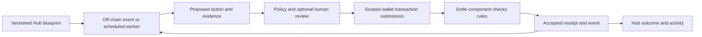

# Ootle Lobby: agents with Ootle-enforced rules

Status: **deferred design; not implemented or deployed**. Reviewed 2026-09-23.
Revisit ticket: [#155](https://github.com/marguerite347/tari-growth/issues/155). This document does not authorize provisioning,
spending, wallet access, contract deployment or autonomous execution. Continue rapid
Hub prototyping without making this architecture a prerequisite.

## Existing foundations and evidence

Ootle explicitly identifies agentic payments as a key use case. Templates are WASM
logic; components are stateful instances called by submitted transactions. Wallet
API keys give agents scoped access, expiration and revocation. These foundations do
not establish a native scheduler or an AI inference runtime inside validators.
No ready-made self-waking agent framework was verified in the public material reviewed.
This is a bounded research finding, not a claim that no internal roadmap exists.

Primary sources, checked 2026-09-23; revalidate against selected release before coding:

- [Ootle introduction](https://ootle.tari.com/)
- [Agent API keys](https://ootle.tari.com/guides/agent-api-keys/)
- [Agent wallet authentication issue](https://github.com/tari-project/tari-ootle/issues/1957)
- [Templates](https://ootle.tari.com/guides/template-overview/)
- [Architecture](https://ootle.tari.com/concepts/overview/)
- [State and execution](https://ootle.tari.com/concepts/state-and-execution/)

Read [TariSkills](skills/README.md), relevant topic metadata and pinned examples before
implementation. The L2 token is **TARI**; follow [terminology](TERMINOLOGY.md).
Wallet authorization scopes are not arbitrary per-recipient or per-period spend limits.
Native TARI is a stealth resource, not an ordinary vault-held fungible token: validate
contract custody and settlement capabilities before promising escrow or budget enforcement.

## Reuse in this repository

- [Blueprint study](BLUEPRINT_SYSTEM_STUDY.md): current workflow diagrams and ComfyUI
  exchange are foundations, not an executable general-purpose agent runtime.
- [Workflow guide](WORKFLOW_AGENT_GUIDE.md), `hub/shared/workflow.mjs`,
  `hub/client/src/WorkflowEditor.tsx`: versioned graph and editor boundaries.
- [Weekly challenges](hub/CHALLENGES.md): existing briefs and project-linked submissions.
- [Learning loop](../.agents/skills/creator-learning-loop/SKILL.md): selected private
  evidence and reviewed sanitized lessons; never publish raw sessions on-chain.
- [Infrastructure plan](DECENTRALIZED_HUB_IMPLEMENTATION_PLAN.md): persistence,
  identity, isolated workers, deployment and deletion policies remain separate work.

## Proposed architecture

Off-chain workers handle timers, model inference, tool calls, file generation and
external observations. On-chain components enforce deterministic authorization,
state transitions, uniqueness and supported resource movements. A component does not
wake itself when a deadline passes: a caller must submit the relevant transaction.
Multiple replaceable workers can observe events; replay protection must prevent
multiple workers or retries from producing duplicate outcomes.

A proposed node palette: Trigger → Condition → Run agent → Review → Submit transaction
→ Record result. Nodes declare execution location, input/output types, permission needs,
side effects, cost limits, timeout and retry behavior. Saving a graph must never execute
it. Validate graphs before enabling runs; simulate first; distinguish simulation, testnet
and production visibly. Bind every run to an immutable blueprint revision.

## First slice: reviewed challenge contribution receipt

1. Creator submits a project version and artifact reference to a weekly challenge.
2. An authorized reviewer approves that specific submission/version. Persist a review
   ID and the attestation contents; edits require new review rather than reusing approval.
3. A durable outbox produces one job keyed by challenge, submission and approved revision.
4. Worker checks the current approval and proposes a transaction. Use a dedicated account
   and least-privilege key; creators configure delegation explicitly, with pause/revoke.
5. Proposed `ChallengeReceipt` component validates authorized issuer/reviewer evidence,
   challenge eligibility and uniqueness. Exact signature/identity verification mechanism
   is an implementation spike, not an assumed API. A hash alone is not authorization.
6. Component records a receipt or issues a badge using a verified resource API. Observe
   accepted transaction outcome before the Hub labels it verified. Submission is pending,
   not success; rejected or fee-only execution is not a completed contribution.
7. Reconcile after crashes/timeouts using transaction identity and unique claim key.
   Query status before resubmitting. Keep cursor/checkpoints durable and backfillable.

Minimum proposed receipt fields: schema version, challenge ID, submission ID, project
version hash, recipient identity, review ID, policy version and unique claim key.
Keep public data minimal. Do not put personal information, private source URLs, prompts,
provider tokens, raw reviews or creator histories on-chain. Explain permanence before
opt-in; deleting Hub history cannot erase a public receipt or independent copies.

No payment in the first slice. Existing pilot challenge goals are not funded prizes.
Badges mean a reviewer approved a contribution, not automatic proof of originality,
quality, safety, profitability or legal ownership. Provide a documented supersession or
revocation policy rather than promising deletion of historical chain records.

## Later use cases

| Workflow | Off-chain work | Proposed on-chain responsibility |
| --- | --- | --- |
| Creator bounties | Match tasks, build deliverables, review quality | Acceptance states and supported conditional settlement |
| Game agents/guilds | NPC planning, guild proposals, game simulation | Asset authority and durable permitted outcomes; not frame-by-frame AI |
| Riff collaborations | Source lineage, contributor agreements | Agreed split rules for supported sales; cannot enforce outside-platform sales |
| Budgeted creation | Provider selection, draft generation, review checkpoints | Payment policy where supported; provider invoices still require adapters |
| Agent services | Task execution and evidence | Orders, acceptance and supported settlement |

An API key with transaction submission permission does not enforce a contract spending
cap if the agent can transfer funds around that contract. Policies must control the actual
assets and operations; test bypass paths. External providers do not automatically accept
TARI, and their billing cannot be constrained merely by recording a budget on-chain.

## Proposed implementation slices (not separate active tickets)

GitHub revisit ticket governs prioritization. Create child issues only when work resumes.

| Slice | Deliverable | Acceptance evidence |
| --- | --- | --- |
| A: protocol/access spike | Pin engine, wallet, indexer and network; capability matrix | Real scoped-auth/revocation trial; documented APIs and unsupported paths |
| B: local receipt component | Issuer rules, uniqueness, version binding | Authorized success; unauthorized, replay and changed-version rejection; rollback tests |
| C: worker and outbox | Durable jobs, reconciliation, bounded retries | Crash before/after submission, timeout, duplicate delivery and restart tests |
| D: review-to-receipt pilot | Explicit creator/reviewer identities and UI states | One approved testnet submission → accepted receipt → Hub display; rejection stays unverified |
| E: blueprint integration | Typed nodes, simulation, pause, trace | Invalid wiring blocked; saves never execute; run bound to reviewed revision |
| F: operational readiness | Storage, recovery, key rotation, observability | Isolated worker, lost-key/revoked-key and restore drills; no secrets in logs |
| G: optional payments | Resource/custody feasibility and policy model | Spend-limit, bypass, recipient, duplicate-payment and failure tests before funding |

## Open decisions and access needed

- Ootle maintainers: is an official automation/keeper or agent-policy template planned?
- Which stable SDK/template versions and network are supported at implementation time?
- Test wallet, test TARI fees, reachable wallet daemon/indexer and interactive key creation.
  Use each developer's own credentials; API keys cannot mint or broaden their own grants.
- Reviewer authority: dedicated signer, component roles, or verified signed attestations?
  Choose identities and recovery/revocation before representing approval as authoritative.
- Badge resource type, recipient privacy, uniqueness scope, and correction semantics?
- Native TARI custody/conditional settlement: what is actually supported? Validate before design freeze.
- Who operates/funds workers, watches failures and retains checkpoints? Eventual progress
  depends on an available worker; component rules alone do not guarantee liveness.
- Model/provider accounts and budgets for optional AI steps; human review of external
  evaluators and data egress. No default export of private session logs.
- Which funded rewards, if any, have explicit owner approval and published terms?

## Success and stop criteria

First establish a no-agent baseline. Measure time from review to accepted receipt,
manual interventions, failed/duplicate attempts, fees, repeated creator corrections,
wasted generations and time to an acceptable creative result. Preserve unknown costs.
Do not claim agent value merely from transaction count. Stop expansion if duplication,
unauthorized actions, misleading verification or increased wasted generation persists.

## Handoff boundary

This is design only. No worker, receipt template, executable graph adapter or deployment
is added by this document. The first revisit should revalidate protocol facts, resolve
access questions and choose one bounded pilot before activating implementation slices.
