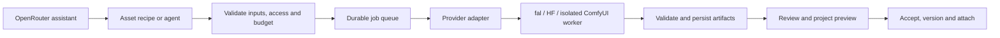

# AI Asset Generator Hub: development design

Status: proposed implementation, not an enabled generation service. Research date: 2026-09-23. Owner: Ootle Lobby product/engineering. No provider calls, paid generations, installs or credential connections were made for this document.

## Recommendation

Build one project-aware asset workspace with outcome-focused recipes and interchangeable execution providers. Start with **make a matching 2D asset**, **edit this asset**, and **turn an approved image into a usable 3D prop**. Add **try it in my game** as the acceptance step. Reuse the Hub’s toolkit, setup wizard, library, versioned projects and node canvas. Put model selection behind a useful task, not in front of it.

Study publicly documented interaction patterns, not private implementations or copied product branding. We can reproduce a useful journey without asserting model parity or reproducing proprietary code. The strongest differentiation is a portable project with an accepted asset, editable recipe, known cost, relevant skills and a working game integration.

## What exists here, and what does not

- `hub/client/src/pages/Assets.tsx`, `hub/server/assets.mjs`: library/upload/attach flows; [current contract](ASSET_LIBRARY.md). Uploads have a 10 MB decoded limit, opaque files and instance-wide visibility. They are not a large generated-asset store or authenticated multi-tenant vault.
- `hub/server/huggingface.mjs`: public discovery and normalized catalog metadata. Finding a model does not supply inference, GPU capacity or access to every HF model.
- `hub/server/buildToolkit.mjs`, `buildBlueprints.mjs`, `buildSetup.mjs` and client `BuildSetupWizard.tsx`: contextual ideas, skills and setup handoff. Extend these instead of creating another wizard.
- [Node workflow guide](WORKFLOW_AGENT_GUIDE.md): saved editable project graphs and ComfyUI references. A graph is not a production job executor.
- [Video workflows](VIDEO_WORKFLOWS.md): reuse capability/estimate/submit/status/cancel/output adapter pattern and review-before-expensive-render approach.
- [Deferred storage design](DECENTRALIZED_HUB_IMPLEMENTATION_PLAN.md): current artifacts must remain recoverable without this Mac. Cloud deployment remains deferred; implement mocked contracts and isolated prototype adapters before requiring a migration.
- This proposal adds a durable job runner, scoped provider connections, artifact validation and outcome-oriented UX. It does not claim these exist today.

## Product evidence and demand limits

Research was through public documentation, product guides and vendor customer stories, not authenticated hands-on trials or private analytics. Treat the following as evidence of supported workflows and selected use cases. Vendor examples have selection bias; tutorials, stars, views and showcase counts do not reveal a feature’s active-user share or retention.

| Product | Documented pattern worth adopting | Demand evidence and confidence | Hub interpretation |
| --- | --- | --- | --- |
| Scenario | Task-specific Apps simplify a pipeline; users can compare results and open its editable workflow. Custom training supports recurring style/subject work. | Official Apps/workflow guides establish functionality. Customer stories emphasize asset variations, style consistency and marketing iteration; medium confidence these jobs matter, unknown prevalence. | Recipe cards first; optional advanced graph. Save a style reference and reuse it across a pack. |
| Rosebud | Start from a template or community game, play/remix, describe changes, preview and iterate. Asset creation sits inside the game-making journey. | Official interface/game-builder guides establish the loop. Public examples are not representative analytics; feature ranking unknown. | A project preview beside a scoped change request, version restore and “replace this asset” rather than regenerate the whole game. |
| Meshy | Image/text input to mesh, texture/remesh options, rigging/animation where supported, then export. | Official API plus published game-production stories support the usefulness of image-to-3D. No verified evidence here that it is the market’s most used tool or that rigging is rarely used. | Approve concept first; review geometry before costly finishing; inspect materials and import into the target engine before accepting. |

Sources: [Scenario Apps](https://www.scenario.com/features/apps), [Scenario workflows](https://help.scenario.com/articles/1669206426-introduction-to-workflows), [Scenario training](https://help.scenario.com/articles/5151772792-basics-of-model-training), [Scenario customers](https://www.scenario.com/customers), [Rosebud interface](https://lab.rosebud.ai/blog/rosebud-ai-interface-guide), [Rosebud game builder](https://lab.rosebud.ai/ai-game-builder), [Meshy image-to-3D API](https://docs.meshy.ai/en/api/image-to-3d), [Meshy customer story](https://www.meshy.ai/customers/37-interactive-entertainment-use-case).

### Priority hypotheses, not competitor engagement rankings

1. **First:** consistent icons/props/backgrounds, reference-guided edits, transparent-background export, preview/compare/undo, attach-to-project. These solve repeated downstream production steps and have bounded acceptance checks.
2. **Next:** approved-image-to-3D static props, mesh/material inspection, engine presets and test-scene import. Static props avoid making rigging quality a prerequisite.
3. **After evidence:** coherent packs and sprite sheets; humanoid rigging and animation; reusable style training; advanced graphs and batch runs.
4. **Defer initially:** arbitrary one-prompt full games, every-model search as the default UI, general-purpose model training, full cinematic pipelines and unrestricted code-running graph nodes. These are costly/high-variance scopes, not proven low-engagement features.

Validate with five to eight creator interviews and observed tasks, including beginners, technical artists and agent users. Ask for the last asset actually shipped, discarded outputs, cleanup time, tool switching and money spent—not only desired features. With participants’ consent, inspect their own histories; do not scrape private activity. Baseline the existing asset flow, then compare a guided recipe with the current model/resource picker. Use equal starter tasks and comparable budgets.

## Information architecture and visual design

Keep the existing **Create → Assets & creation tools** entry. Within that workspace use **Generate · Edit · My assets**, retaining a clear Browse library link. Do not add a competing global navigation tab.

Entry cards show an actual reviewed input/output pair, expected output format, rough cost availability, setup state and “Use in a game” example. First three cards: **Match my game’s style**, **Change one thing**, **Make a 3D prop**. Extend to characters, sprites, textures, audio and VFX only after the recipe is verified. Do not label a static render as a playable example.

Desktop workspace: compact task/reference panel on the left; large 2D comparison or 3D viewer in the center; collapsible project tray/version history on the right. Bottom action strip shows selected provider/model, estimated cost or “estimate unavailable,” and the next action. Mobile uses task → preview → review steps with persistent back navigation. Advanced node graph is an explicit “Edit recipe” mode, never required for a first asset.

Brand: dark Tari surfaces, lavender controls, lime reserved for a successful accepted result. Gentle progress motion during jobs; meaningful celebration when an asset passes checks and is added to the project. Reduced motion and Effects off apply. Avoid endless fake progress bars, modal stacks and a confetti burst for a failed or merely queued job. Keep the native cursor readable.

### Flow A: make a matching 2D asset

1. Start from a project/selected foundation; inherit engine, asset slot, dimensions, style references and budget. Without a project, offer a temporary draft with a clear save step.
2. Ask what is needed: icon, background, prop or character. Show reference-based generation before recommending training. Preserve the chosen idea from the toolkit.
3. Propose one compatible recipe and a short list of relevant skills/assets. Show missing access inline. “Browse existing assets instead” stays available.
4. Generate one inexpensive draft (small comparison batch only when explicitly chosen). Review identity, silhouette, palette, alpha and legibility at actual game size.
5. Let the creator pin a result, mask a region, change one attribute, branch a variant or undo. Preserve parent artifact and prompt history; edits never overwrite accepted output.
6. Approve → export PNG/WebP and manifest → test in the selected slot → save project version. A generation success alone is not project acceptance.

### Flow B: make a 3D prop

Prompt → approved concept image → geometry draft → orbit/wireframe/scale inspection → texture/PBR → optional mesh optimization → target-engine preview → accept/attach/export. Offer Meshy via fal alongside qualified self-hosted candidates. The model backend is replaceable, but stages and output semantics are not assumed identical.

The viewer displays triangles, bounds/units, UV/material slots, texture maps, file size and validation findings. Check front/back and underside, not just the flattering thumbnail. Preserve the original high-detail mesh and derived optimized versions. Set project-specific polygon, texture-memory and download budgets; do not promise universal “game-ready” output.

Rigging is a later branch: assess topology/pose eligibility → rig → play idle/walk and deformation test → retarget/import check. Unsupported non-humanoids must get an explicit limitation or manual workflow. Rigging is not the same as animation generation. Unity, Unreal and Godot presets require separately tested materials, orientation, scale and animations; GLB-first is a good interchange baseline, not proof all engines import identically.

### Flow C: change my game using the asset

From a selected game object, request a scoped visual or mechanic change. Assistant proposes a file/asset diff and acceptance test using the project’s real skills and dependencies. Run generated code only in an isolated preview with no provider credentials, host filesystem access or unrestricted network. Show before/after gameplay, console failures and rollback. A successful asset generation cannot silently authorize arbitrary packages, deployment or a whole-game rewrite.

The assistant can use OpenRouter; asset jobs can use fal/HF/ComfyUI. These are distinct roles. Code preview/execution and a safe build runner are new development, not accomplished by adding an LLM key.

## Provider and open-model mapping

The following are candidates, not tested drop-in equivalents. Pin model revision, pipeline/container and recipe versions after the bake-off. Open weights and permissive open-source licenses are separate properties. Preserve source/terms metadata; do not turn licensing research into the product’s primary user flow.

| Job | Candidate route | What it replaces / boundary |
| --- | --- | --- |
| 2D concept generation | Qwen-Image via compatible hosted endpoint or isolated Diffusers/ComfyUI worker | Candidate for the generation stage, not all Scenario capabilities. Verify selected revision and hardware. |
| Reference-based changes | Qwen-Image-Edit | Candidate for image-edit stage; test identity/style preservation and masked edit behavior for the exact pipeline. |
| Style consistency | Reference-conditioned recipe first; optional LoRA training on a reviewed compatible image model later | Reference conditioning is not guaranteed consistency. A reusable dataset/style card is valuable even before training. |
| Image-to-3D with materials | TRELLIS.2 or Hunyuan3D-2.1 on a controlled GPU worker | Candidates for geometry/material stages. Neither is asserted equivalent to Meshy’s end-to-end service. |
| Fast 3D draft | TripoSR | Lower-cost draft candidate; not equivalent to current commercial Tripo or a full PBR/rigging pipeline. |
| Rigging research | UniRig + explicit retarget/deformation workflow | Separate research spike, not automatic animation or guaranteed production rigs. |
| Mesh cleanup, validation and export | Versioned Blender worker scripts | Deterministic operations where appropriate; simplification can damage silhouettes/UVs and requires review. |
| Generation graph execution | Pinned, reviewed ComfyUI workflows on isolated workers | Reuses graph-oriented asset pipelines. Arbitrary uploaded custom nodes must not execute on the Hub server. |
| Planning, prompt refinement, code edits and feedback summarization | OpenRouter-selected model, or a qualified self-hosted coding model | Provider capability and tool/structured-output support must be checked. LLM routing is not a mesh generator. |
| Managed commercial 3D | fal → Meshy | Explicit paid alternate using the user’s fal connection. A separate direct Meshy adapter is optional later, not an assumed requirement. |

Primary references: [Qwen-Image](https://huggingface.co/Qwen/Qwen-Image), [Qwen-Image-Edit](https://huggingface.co/Qwen/Qwen-Image-Edit), [TRELLIS.2](https://github.com/microsoft/TRELLIS.2), [Hunyuan3D-2.1](https://github.com/Tencent-Hunyuan/Hunyuan3D-2.1), [TripoSR](https://github.com/VAST-AI-Research/TripoSR), [UniRig paper/project](https://arxiv.org/abs/2504.12451), [ComfyUI](https://github.com/Comfy-Org/ComfyUI).

Infrastructure matters: TRELLIS.2’s README specifies Linux/NVIDIA and at least 24 GB GPU memory; Hunyuan3D-2.1 documents approximately 10 GB shape, 21 GB texture and 29 GB combined requirements. Treat these as upstream reference configurations, not measured Hub requirements. Self-hosted does not mean free or runnable in a browser/Mac. Hugging Face (HF) model discovery is separate from [Inference Providers](https://huggingface.co/docs/inference-providers/index), dedicated endpoints or our own GPU workers; availability is per model/task/provider. A public Space is not a production SLA.

## Connect accounts and tokens

Add **Connections** inside the asset workspace and existing setup wizard. Each connection shows owner/workspace, supported tasks, billing source, model access, last checked timestamp and status: not connected / credentials stored / access checked / trial verified / expired. Store only an opaque connection ID in project manifests. No global shared user key for a public multi-user service.

**OpenRouter:** support “Connect OpenRouter” with the documented PKCE flow, plus manual BYOK in a secure settings form. Use S256, a one-time verifier and a session-bound callback transaction, expiry/replay rejection and allowed callback URLs. Exchange the authorization code server-side; store the returned user-controlled key in an encrypted cloud secret store, never localStorage, project JSON, logs or Git. Mask it in UI, offer replace/disconnect, and explain whether provider-side revocation still needs a user action. Do not assume revocation/refresh semantics without checking the current API. Fetch model metadata/capabilities; let the user choose model and project spend ceiling. No silent fallback to a different paid model/provider. [OpenRouter PKCE](https://openrouter.ai/docs/guides/overview/auth/oauth), [model selection](https://openrouter.ai/docs/guides/overview/models).

**fal:** store a user/workspace-scoped FAL_KEY server-side. Expose allowed endpoints through our authenticated proxy, never a generic arbitrary-url proxy. The verified documentation lists `fal-ai/meshy/v6/image-to-3d`, with queue/status/result operations and schema-dependent texture, remesh and humanoid rig/animation controls. Pin/test that contract when implementing; endpoint availability/pricing may change. The creator sees “Meshy via fal” and the fal billing account, not a fictional open-source Meshy. [Meshy on fal](https://fal.ai/models/fal-ai/meshy/v6/image-to-3d/api).

**HF/self-hosted:** scoped HF token only where required; select hosted provider, dedicated endpoint or a managed GPU worker explicitly. Check gated model access, runtime and quota separately. Envato remains optional licensed source material, not a required inference provider. No token should be requested in an agent chat or committed setup checklist.

Wizard: select outcome/engine → choose proposed recipe → detect required connections → ask creator to sign in/configure secrets privately → read-only capability/access check where available → show cost and ask only for missing decisions/authorization → run a bounded trial → record verification. Agents receive `needs_user_input` questions and may continue independent work; elapsed time is not permission. Never auto-run a paid trial just to see whether a key works. For the private prototype, operator-managed environment secrets can back a single clearly identified connection; do not expose multi-user BYOK before auth and encrypted storage exist.

## Execution architecture and contracts

Define a provider adapter with `capabilities`, `validate`, `estimate`, `submit`, `status`, `cancel` and `collectArtifacts`. Models expose task-specific input/output schemas, credential requirements, supported controls, content constraints, cost units and cancellation semantics. Do not normalize away capabilities: if one backend lacks PBR or rigging, disable that recipe step with an explanation.

Proposed endpoints, not current routes:

- `GET /api/generation/capabilities`: qualified recipes/models and connection status, without secrets.
- `POST /api/generation/quotes`: validate project, input manifest and requested steps; return estimate/range or unavailable, assumptions and expiry.
- `POST /api/generation/jobs`: quote ID, recipe revision, project head, input hashes, connection IDs, spend ceiling and idempotency key.
- `GET /api/generation/jobs/:id`, `POST .../:id/cancel`: tenant-scoped state and supported cancellation.
- `POST /api/generation/jobs/:id/accept`: approved artifact IDs and expected project head; acceptance conflict must not regenerate.
- `/api/connections/*`: authenticated connect/check/replace/disconnect and OpenRouter callback. Never return raw stored keys.

Job states: draft → needs_setup/ready → queued → running → validating → awaiting_review → accepted/rejected; failed/cancel_requested/cancelled/unknown states are explicit. A network timeout after submit is **unknown**, not a license to resubmit. Persist provider request ID and reconcile status. Use an outbox/idempotency guard for submit and deduplicate callbacks. Cancellation may not stop upstream spend; show actual supported behavior. Bound retries to safe polling/collection or explicit user-approved new runs.

Record `projectId`, recipe/model revisions, input/output hashes, parent artifact, chosen provider, sanitized parameters, estimate, actual/unknown usage, timestamps, status and acceptance evidence. Budget reservations must be atomic per workspace so simultaneous jobs cannot bypass the ceiling. Account for LLM tokens, images, training, GPU time and cleanup/export separately; cheap generation with extensive cleanup is not cheap accepted output.

Artifacts belong in private durable object storage with metadata in a database; repository stores recipes, code, schemas, tests, reviewed examples and restore manifests. Use signed upload/download URLs, bounded content-type/size validation, asset parsers in isolation, dependency-pinned workers and allowlisted provider fetching to prevent SSRF. Imported output URLs expire: collect approved outputs into owned storage with checksums before claiming portability. Keep drafts private by default; publishing is a separate explicit action. Version deletion removes managed blobs when unreferenced, respects shared references and documents any upstream retention beyond our control. This follows the deferred storage plan rather than making the Mac the only store.

## Evaluation and measurement

Smallest trial before scaling: one stylized prop and one four-icon set, same approved references, same engine target. Compare a managed route with a self-hosted candidate using equal total budgets; include setup, failed calls, latency, cleanup and export. Do not spend until the trial budget is authorized. Preserve rejected attempts and reasons as sanitized metadata, not private prompts in analytics.

Acceptance rubric: reference/style fidelity, controllability of a single edit, silhouette/readability, actual format validity, target-scene rendering, runtime asset budget and restore from a fresh environment. For 3D add UV/material correctness, back-view quality, scale/orientation and optional deformation checks. A reviewer can fail aesthetics even when automated checks pass. Report each provider’s results without claiming one universally wins.

Instrument recipe impression → start → setup blocked → quote viewed → submit → valid output → edit → accepted → attached → target preview passed → exported/published → repeat use. Segment by creator experience, engine, task, provider and account-vs-agent use. Record cancellation, generation failure and rejection reason separately. Do not collect raw API keys, source logs or private prompts in analytics.

Primary metric: **cost and elapsed time per asset accepted into a working project**. Supporting measures: wasted generations per accepted asset, repeated correction rate, first-session successful attachment, export/import failure and 7-day repeat creation. Report medians and tail latency plus denominators. A low-click feature may be buried or blocked, not unwanted. Predeclare pilot thresholds after baseline: aim for fewer wasted generations and faster acceptable results without lower reviewer quality; do not invent competitor benchmarks. Reassess after enough completed tasks across both novice and experienced users, not a handful of showcase clicks.

## Suggested backlog (not opened issues)

| Ticket | Dependencies | Deliverable and acceptance |
| --- | --- | --- |
| AIG-01 Evidence and task benchmark | None | Interview script, anonymized task observations and baseline; distinguish vendor statements, observations and hypotheses. |
| AIG-02 Recipe/capability schema | None | Typed recipes for 2D edit and 3D prop, fixtures and capability gating; unsupported controls cannot submit. |
| AIG-03 Workspace UX prototype | AIG-02 | Task cards, compare/history, 3D inspect mock and setup handoff; keyboard/mobile/reduced-motion walkthrough; no fake live generation. |
| AIG-04 Connections foundation | Auth/secret-store decision | Tenant authorization, encrypted secret refs, redaction, replace/disconnect; cross-user access and key-leak tests fail closed. |
| AIG-05 OpenRouter connection and assistant | AIG-04 | PKCE/manual BYOK, explicit model and budget; callback replay, denied access, expired key and unsupported tool output tests. Scoped text/edit proposals first; no host execution. |
| AIG-06 Job runner and budget ledger | AIG-02/04, durable store | Queue, idempotency, usage reservations, status reconciliation and cancellation; duplicate-submit and timeout tests show no automatic double-charge retry. |
| AIG-07 fal Meshy adapter | AIG-06 | One bounded image-to-3D job, collect GLB/materials, real failure/status handling and persistent artifacts; separately qualify optional rigging. |
| AIG-08 HF/open-model image adapter | AIG-06, GPU/provider access | Qwen image/edit candidate trial, exact pinned revision, reference edit and export; inaccessible model gives a useful setup question. |
| AIG-09 Open 3D bake-off | AIG-06, authorized GPU budget | Compare TRELLIS.2/Hunyuan3D/TripoSR where appropriate; publish measured acceptance/cost, not just screenshots. Select one supported route. |
| AIG-10 Artifact inspector and project import | AIG-03/06 | Signed storage, parser isolation, before/after/3D preview, expectedHead attachment, import checks and fresh-environment restore. |
| AIG-11 Telemetry and feedback | AIG-01/03/06 | Consent-aware funnel, rejected-output reasons and accepted-asset cost; use existing build-feedback review loop. |
| AIG-12 Packs, rigs and advanced graphs | Pilot evidence | Prioritize from measured needs; temporal sprite consistency, rig deformation, LoRA dataset/version and graph execution isolation each get separate acceptance gates. |

Suggested release slices: (1) mocked recipe UX plus connections contract; (2) one paid managed asset end-to-end with explicit budget; (3) qualified open-model alternative under the same UI; (4) scoped game-preview edits; (5) batch/training/rigging expansion based on usage. Avoid implementing ten providers before one output survives a real project import.

## Decisions/access still needed

- Workspace identity and hosting ownership; secret manager/database/object storage provider and region. DigitalOcean can be evaluated under the existing deferred plan, not assumed provisioned.
- Who pays: personal BYOK or team budget; max per trial/project and concurrent jobs; provider retention and acceptable destinations for private references.
- Authorized fal/OpenRouter/HF accounts, model access, GPU runtime and webhook URL; no credentials needed to review this plan.
- First target: recommend browser game + GLB static props, then separately validate Godot/Unity/Unreal exports. UEFN has distinct import and Verse constraints.
- Pilot participants, initial asset reference pack, art-review owner and tolerated cleanup time.
- Which upstream models pass the measured quality/terms/hardware gate; exact current endpoints and prices must be refreshed before implementation.

## Handoff and status

Resource-first selection: reused existing library, toolkit/setup, graph/version and feedback designs; consulted official public product guides and model/provider documentation. No new dependencies or paid trials were required to produce this design. Initial implementation should read this plan, AGENTS.md and the linked existing contracts, then execute only the chosen slice with its actual access/budget checks. All runtime features and ticket rows above remain proposed until separately built and verified.
