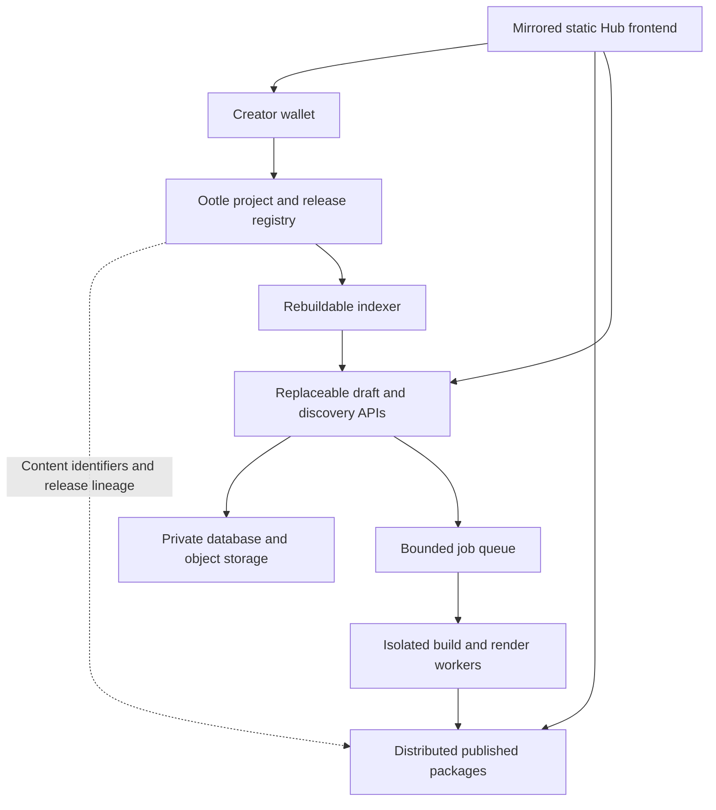

# Ootle Lobby: cloud and Tari Ootle implementation plan

**Status: deferred design / suggested tickets. Last reviewed: 2026-09-23.**

The creator explicitly requested documentation now so rapid prototyping can continue.
This plan does not authorize provisioning, billing, data migration, public publishing,
contract deployment, autonomous agents, or deletion of local files. None of the target
architecture below is claimed deployed. Revisit the plan when hosting work is resumed.

Revisit tracking: [#156](https://github.com/marguerite347/tari-growth/issues/156).
The issue is open for later planning; implementation remains deferred. See also the
[agent architecture plan](AGENT_OOTLE_IMPLEMENTATION_PLAN.md) and its separate pilot.

## Decision and scope

Continue product, game and marketing prototypes with the current development workflow.
Cloud migration and decentralized publishing are a later workstream, not prerequisites
for every prototype. Keep interfaces/exportable source clear, but do not build speculative
infrastructure or require wallet transactions for ordinary draft saves.

The long-term rule remains: a personal Mac must not be the only durable home of creator
data. Git owns platform code, rules, skills, schemas, reviewed seed data and deployment
configuration. Private data, credentials, logs and large media must not be committed to
the platform repo. The existing local preview/data is a temporary migration source;
preserve it until a verified destination and restore test exist. This plan changes no
running service, storage path, access permission or prototype startup command.

These ticket sketches are design proposals, **not a second active backlog**. On resumption,
match them to existing CH issues and create/link only missing work in GitHub. Proposal
labels below are local document anchors, not assigned CH IDs, priorities or promises.

## Current implementation and reusable foundations

- Express/React prototype: [hub README](hub/README.md).
- Git-backed projects, saves, forks and single-process locking: `hub/server/projects.mjs`.
- Capability-protected history removal: `hub/server/projectManagement.mjs` and
  `hub/client/src/components/ProjectHistory.tsx`. Browser-held keys are interim access,
  not cross-device authenticated creator accounts; other writes need ownership checks.
- Runtime and preview paths: `hub/server/paths.mjs`; playable builds use separate
  content-addressed artifacts. Reference URLs are not automatically archived content.
- Existing history/deletion boundaries: [storage guide](hub/STORAGE_AND_HISTORY.md).
- Existing private hosting migration option: [DigitalOcean migration](hub/deploy/digitalocean/README.md).
- Native protocol onboarding: [TariSkills](skills/README.md), `skills/catalog.json`,
  task-specific metadata and pinned engine examples. Revalidate on the selected network.
- Production review and the private learning loop remain reusable for bounded build
  trials, creator approvals and sanitized lessons; they are not proof of chain execution.

Before coding, inspect the actual serving checkout and current state. File names and
network interfaces may have changed since this design was written.

## Proposed target architecture

| Responsibility | Proposed authority/storage | Availability and trust boundary |
| --- | --- | --- |
| Platform source and deployment recipes | Git repository with reproducible builds | Independent operators can rebuild; private operational data excluded |
| Website and published browser-game packages | Content-addressed distributed storage, independently retained copies and alternate gateways | CIDs/hashes establish identity, not ongoing availability; retention must be funded |
| Published project authority and releases | Native Ootle templates/components, wallet-authorized updates | Defines who may update a project, not legal ownership or originality of uploaded IP |
| Private drafts, profiles, account recovery, permissions | Managed database and private object storage | Operator-controlled service with deletion and retention policy; not decentralized by itself |
| Search and public discovery | Rebuildable index over registered releases and curated metadata | An indexer/cache is a view, not independent proof of finality; clients need alternate providers |
| Builds, renders, captures and agent work | Queue plus isolated, replaceable workers | Never execute arbitrary creator code inside the main API or with signing secrets |
| Durable backups | Separate access-controlled cloud copies and tested restoration | Published chain history, managed backups and independent forks have different deletion semantics |

Provider choice is open. DigitalOcean is preferred to assess first, not an exclusive
protocol dependency. A Droplet plus persistent volume is a possible low-change private
migration bridge. A managed/serverless API plus database/object storage is the proposed
longer-term application shape. Neither choice is required to continue prototypes.
Spaces/S3 storage is not a POSIX Git filesystem. The current Git/JSON store cannot be
made serverless by changing a path. Keep existing version semantics behind an adapter,
then choose archived Git bundles versus deduplicated file snapshots through a trial.

Managed Agents is optional remote execution. Session persistence is not an app backup
policy or a guarantee of 24/7 human support. Do not make it a dependency for publishing.

## Creator flows

### Create and save privately

1. Sign in; optionally connect a wallet. Define account-to-wallet linking and recovery.
2. Create a project and edit. Autosave private snapshots without a chain transaction.
3. Show durable save confirmation only after the server acknowledges storage. Retry
   idempotently, detect competing edits, and preserve a recoverable failed save.
4. My projects lists drafts, published projects and archives independently of browser.

### Publish a public release

1. Choose the saved version and what source/assets may be shared. Scan for secrets and
   validate licenses; preview exactly which files and metadata become public.
2. Build in an isolated worker. Generate a canonical manifest and content digest.
3. Upload and verify the complete package with independent storage providers. A valid
   digest proves bytes match, not game safety, attribution, quality or permanent hosting.
4. Show fees and public-record consequences, then ask the wallet to authorize publication.
5. Track submission through confirmed network outcome. Mark published only after verified
   finality and package availability; a wallet signature alone is not publication.
6. Handle upload-success/transaction-failure as a recoverable staged release. Reconcile
   delayed confirmations before retrying; avoid duplicate release transactions.

### Discover, play and Riff

1. Resolve a project and release using a selectable indexer/provider.
2. Fetch through a gateway and verify package content against the registered manifest.
3. Run browser games on an isolated origin/sandbox with explicit capabilities; downloaded
   source is untrusted. A frontend mirror must not inherit the creator's signing secrets.
4. Fork an allowed release into a private draft; record original project/release identifiers.
5. Publish a Riff with its own authority and declared parent. Lineage is a recorded claim;
   content licenses still determine permission to copy, modify and distribute.

### Manage histories and old games

- **Delete draft/version:** remove private stored snapshots subject to retention policy;
  keep the current game by default. Shared blobs survive while another retained version
  references them. Prevent accidental deletion of a published release dependency.
- **Archive project:** reversible hide from the creator's main library; no asset deletion.
- **Unpublish release:** stop promoting it in our catalog and record a withdrawal marker
  where appropriate. Never claim this erases chain history or independent copies.
- **Delete account/private activity:** separate flow with exact scope, recovery window,
  backup retention and an export option. Do not mix it with project-history cleanup.
- Public chain entries, mirrors, downloads and independently retained IPFS data cannot be
  universally recalled. Private drafts should not be public-pinned automatically.

### Operate and recover

1. Bound a worker job's inputs, tools, spend and time; record the resulting artifact.
2. Back up database plus referenced files consistently; test restoration on another host.
3. Verify an alternate frontend, storage gateway and indexer can open a release without
   our app API. Distinguish optional search/recommendations from essential publishing.
4. Keep central dependencies visible. A pinned website calling one indispensable private
   API is not an independently usable decentralized Hub.

## Suggested implementation tickets

Each proposal should become or join a GitHub issue only when the workstream is activated.
Dependencies below express order, not a requirement to implement everything at once.

### P01 — Inventory and choose one pilot

- Scope: inventory projects, Git histories, media, external symlinks, absolute URLs,
  private data classes and current capabilities; select one disposable representative game.
- Acceptance: sanitized counts/size estimates, persistence map, success criteria and
  export/restore evidence. Private manifests stay outside Git.
- Depends on: none. Access: read access to current instance; no cloud credentials needed.

### P02 — Select hosting, storage and retention

- Scope: compare private volume bridge with managed/serverless target, regional availability,
  expected database/storage/egress/build costs and provider lock-in.
- Acceptance: approved account/team, region, budget, domain/private access, retention,
  restore objectives and architecture decision. No purchased resources in a planning ticket.
- Depends on: P01. Access: provider console, billing authority and DNS owner.

### P03 — Durable project/version storage adapter

- Scope: explicit project/version/blob interfaces; import existing histories without loss;
  decide canonical manifest serialization, hashes, parent lineage and source export format.
- Acceptance: create/save/reload/fork/export/import parity; conflict/idempotency tests;
  byte/hash checks, restart survival and orphan-blob cleanup without breaking retained games.
- Depends on: P01–P02. Access: isolated database/object-store test environment.

### P04 — Creator identity and cross-device permissions

- Scope: account login, wallet linking, roles, recovery, scoped agent credentials and legacy
  browser-capability migration. Enforce ownership on every write, not only deletion.
- Acceptance: second-device access, unrelated-user rejection, revocation, lost-key recovery,
  project transfer rules and no secrets in packages or public API responses.
- Depends on: P02 and storage contracts from P03. Access: identity provider and wallet test setup.

### P05 — Public package format and replicated availability

- Scope: package website/game/source/media with immutable identifiers; pin through at least
  two independent operators; verify all referenced assets and gateway origin isolation.
- Acceptance: complete game opens through either provider; failed pin blocks publication;
  missing asset, tampering and provider outage have visible errors and recovery.
- Depends on: P03. Access: storage provider accounts, retention funds and content rights.

### P06 — Ootle project/release registry template

- Scope: prototype owner-authorized create/publish/update-authority/withdraw transitions;
  store small release references, content hashes and parent relationships, not video payloads.
- Acceptance: pin toolchain/network; local engine tests cover unauthorized calls, duplicate
  releases, stale state, authority changes and rollback. Small live testnet trial then
  verifies receipts and independent reads. No mainnet-readiness claim from local tests.
- Depends on: manifest contract from P03/P05. Access: Esmeralda endpoints, wallet and test funds.

### P07 — Wallet publication and transaction reconciliation

- Scope: staged upload → signing → submission → verified outcome; explicit fee/public-data
  preview; resumed sessions and dropped client connections.
- Acceptance: rejected signature, insufficient funds, timeout, delayed finality and retry
  leave no false published status or duplicate release; private signer stays in wallet.
- Depends on: P04–P06. Access: selected wallet connector and network compatibility evidence.

### P08 — Rebuildable discovery and frontend mirrors

- Scope: consume registry state/events with resync support; alternate indexers/gateways;
  deploy reproducible static frontend; separate curated moderation from canonical records.
- Acceptance: rebuild index from supported network reads; open and verify the pilot through
  an independent frontend with our app API unavailable. Document any remaining dependencies.
- Depends on: P05–P07. Access: independent endpoint operators and optional domain configuration.

### P09 — Isolated jobs and optional managed agents

- Scope: queue builds/renders with idempotency, artifact handoff, resource limits, cancellation,
  spend caps and restricted egress/tool credentials. Benchmark one existing workflow first.
- Acceptance: untrusted game code cannot read other jobs or signing secrets; failed/retried
  jobs do not duplicate spending or publishing; measured cost and creator acceptance recorded.
- Depends on: P02–P04. Access: worker provider; licensed render tools/models; separate approval
  for any external evaluator receiving session excerpts. Managed Agents is optional.

### P10 — Lifecycle controls and retention-safe cleanup

- Scope: draft deletion, keep-current cleanup, reversible archive, release withdrawal,
  account/activity cleanup and shared-object reference tracking.
- Acceptance: exact confirmation scope; authorization tests; current games and forks survive;
  archive restores; backup/chain/copy exclusions visible; cleanup cannot delete referenced blobs.
- Depends on: P03–P04; P06–P07 for public-release actions. Access: approved retention policy.

### P11 — Backup, observability and disaster recovery

- Scope: consistent encrypted backup, version-aware object inventory, restore runbook,
  monitoring and access audit with private-log retention.
- Acceptance: restore on independent cloud target and verify histories/build bytes; exercise
  failed-save, queue, storage and endpoint alerts. Define recovery time/data-loss tolerances.
- Depends on: P02–P05. Access: backup destination, operator identity and alert configuration.

### P12 — Migration, private pilot and local retirement

- Scope: freeze writes; stage-copy full data; migrate origin-scoped keys and localhost links;
  validate; switch private users; monitor; retire local copies only after verified recovery.
- Acceptance: every inventoried project/version/media dependency accounted for; no lost
  edits during cutover; old credentials handled; rollback boundary documented. Local cleanup
  is an explicit final action, not an automatic side effect of deploy.
- Depends on: P03–P04, P10–P11; decentralized release features only if selected for pilot.
- Access: source/destination permissions, private hostname and creator acceptance of cutover.

### P13 — Independent-operator pilot and public readiness review

- Scope: have another operator run the frontend/indexer/storage adapter; test abuse controls,
  package isolation, content policy, upgrade authority and contract review.
- Acceptance: pilot publish/verify/remix works without our service; unresolved central
  dependencies disclosed; fees/storage funding/support ownership clear before public launch.
- Depends on: P05–P08, P10–P11. Access: independent operator and review resources.

## Unknowns and access questions to resolve later

| Question | Needed from / how to resolve | Blocks |
| --- | --- | --- |
| Which DigitalOcean team, region and monthly cap? | Account owner; authenticated console; no tokens in chat or repo | P02, provisioning |
| Bridge migration or direct managed/serverless refactor? | Trial effort, data size, operating costs and pilot deadline | P02–P03 |
| Login provider, wallet connector and recovery authority? | Product/security decision plus connector compatibility trial | P04, P07 |
| Who controls registry upgrades and Hub frontend updates? | Explicit creator/operator governance and recovery design; no implied DAO | P06, P13 |
| Which Ootle network, exact toolchain, endpoints and fee policy? | Recheck official docs and actual node; test wallet/funds and transaction evidence | P06–P08 |
| What is public when publishing: build, source, profile, lineage? | Creator consent, licensing and metadata review | P05–P07 |
| Who pays for pins, backups, egress and abandoned releases? | Account owner, storage estimates, quotas/retention policy | P02, P05, P10 |
| Which independent pinning and indexer providers can we actually access? | Verify service credentials, coverage and failure behavior | P05, P08, P13 |
| What archive/restore window and private-data deletion promise? | Product retention decision, backup design and shared-reference checks | P10–P12 |
| Where do player saves and multiplayer state live? | Each game defines export/sync and server requirements; Hub source history does not back them up | Game-specific tickets |
| What domain/private-access setup is available? | DNS owner and authorized team membership | P02, P12 |
| Which media/model/editor licenses permit cloud builds and redistribution? | License holder and provider terms at implementation time | P05, P09 |
| May agents send selected logs to external evaluators? | Explicit per-connection data scope and creator approval; default private | P09 |
| How much existing source/media is outside known runtime directories? | P01 inventory, including broken references and symlink targets | P12 |

No access in this table is represented as granted. Resolve questions only when relevant
to the selected next milestone; do not interrupt unrelated prototyping to collect them.

## Resume sequence and smallest useful proof

1. Read this plan, AGENTS.md, the storage/migration guides and current native skill metadata.
2. Reinspect implementation, GitHub issues, provider docs and network availability. Link
   existing issues before proposing new ones; choose bridge versus direct refactor explicitly.
3. Select a disposable game and run **private save → publish package → wallet-authorized
   testnet registry entry → independent retrieval/hash check → Riff**. Exercise failure
   paths, not only the happy path. Use no real private draft or production funds.
4. Separately prove private version deletion, current-game preservation and backup restore.
5. Record actual time, cost, UX acceptance and remaining central dependencies. Expand only
   after the small proof supports the design. Do not describe sketches as deployed features.

## Reference material (recheck before implementation)

- [Ootle state and execution](https://ootle.tari.com/concepts/state-and-execution/)
- [Ootle architecture](https://ootle.tari.com/concepts/architecture/)
- [Ootle publishing guide](https://ootle.tari.com/guides/publishing-templates/)
- [IPFS pinning and persistence](https://docs.ipfs.tech/how-to/pin-files/)
- [DigitalOcean App Platform storage constraints](https://docs.digitalocean.com/products/app-platform/how-to/store-data/)
- [DigitalOcean Functions limits](https://docs.digitalocean.com/products/functions/details/limits/)
- [DigitalOcean Managed Agents architecture](https://docs.digitalocean.com/products/managed-agents/agent-harness-runtime/concepts/architecture/)

These were consulted during the architecture discussion on 2026-09-23. They are not
version-pinned implementation evidence or a commitment to provider availability/pricing.
