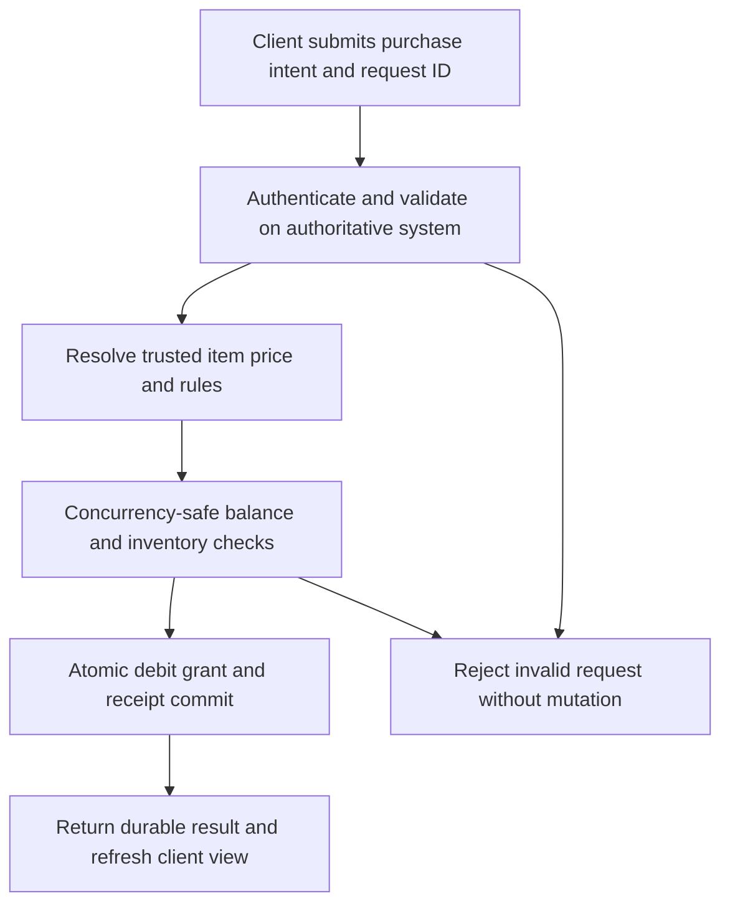

# Economy design and balancing

Proposed Ootle Lobby learning and Riff section for progression, game economies and simulation. These are game-design tools, not guarantees of balanced gameplay or financial outcomes. No workbook, simulator or integration has been implemented yet.

## Learning path and template deliverables

| Module | Planned reusable artifact | What creators should evaluate |
| --- | --- | --- |
| Sources, sinks and balances | Spreadsheet ledger with separate currency/resource types, inflows, outflows, transfers, caps and reset rules | Balances over time, affordability, accumulation and bottlenecks. Transfers are not destruction; each source does not require a matching sink. |
| Progression curves | Spreadsheet comparing editable linear, exponential and piecewise curves | Cost/power ratios, time to upgrade, difficulty transitions and sensitivity to assumptions. No universal growth multiplier. |
| Loot and rarity | Probability/expected-value worksheet with conditional drops and combination rules | Tail outcomes, drought lengths, rarity distributions and dominant combinations. Mean values alone are insufficient. |
| Shops and rerolls | Configurable purchase/reroll model | Affordability by stage, reroll strategy, resource exhaustion and runaway loops. |
| Farming/crafting loops | Dependency diagram plus production/consumption model | Time, energy, capacity, seasonal constraints, upgrade payback and circular amplification. |
| Riff compatibility | Proposed economy manifest and comparison report | Units, rule ordering, additive versus multiplicative effects, stacking limits, rounding and interactions with other modules. Field names are our future schema, not claimed SMODS/Content Patcher standards. |
| Simulation and playtests | Reproducible scenario runner and baseline-versus-remix report | Multiple player strategies, fixed seeds, parameter sweeps, distributions and extreme cases; compare to playtest observations. |

Each artifact needs assumptions, units, editable inputs, baseline scenario, expected outputs, validation examples, source/license information, version and history. Model spreadsheets with separate Inputs, Rules, Scenarios and Results tabs. Provide shareable spreadsheet and machine-readable parameter formats so a creator can change a value and inspect the effect without rewriting the model.

Use illustrative parameters only and label them. There is no verified universal 1.2x-1.5x progression rule. A valid configuration file does not guarantee compatible behavior, crash freedom or a balanced economy. Net issuance is a design variable; inflation cannot be concluded from the absence of a one-to-one source/sink pairing.

## External resource inventory

- [Machinations framework basics](https://machinations.io/docs/framework-basics): verified documentation for sources, pools, drains, converters, traders and gates.
- [Machinations documentation](https://machinations.io/docs): lists simulation, Monte Carlo, history, collaborative editing and Google Sheets topics. Specific marketplace examples, performance claims, export/API access and account requirements must be checked before promising integration.
- [Summer Engine farming-sim page](https://www.summerengine.com/templates/simulation/farming-sim/stardew-valley-style): vendor describes linked farming/social/dungeon systems and scaffolding. Treat as an evaluation candidate. Executable template availability, licensing, maintenance and automatic balancing claims have not been validated.
- [SMODS documentation](https://docs.smods.dev/) and [Content Patcher source/docs](https://github.com/Pathoschild/StardewMods/tree/develop/ContentPatcher): framework-specific implementation references. Verify actual fields and hooks individually; do not invent a common BaseCost/RarityTier/MultiplierValue/ScalingFactor API.

The pasted generic domain citations do not support the precise claimed progression rule, marketplace inventory, simulation speed or universal config fields. Do not repeat those claims as established facts.

## Currency transactions and authoritative state

Add a reusable learning module and tested transaction example under CH-015. Economic modeling describes desired behavior; implementation must separately establish authorization, concurrency, persistence and recovery.

### Ledger and modeling contract

Track currency in defined units and time windows. Distinguish issuance/rewards, destruction, transfers, conversions and refunds. A purchase is a sink only if currency leaves the modeled economy; payment to another participant or treasury is a transfer.

- Closing balance = opening balance + issuance + incoming transfers - destruction - outgoing transfers, with conversions/refunds classified explicitly and once.
- Average reward per win × wins per hour estimates currency/hour under stated assumptions.
- Base cost × factor^tier is a price per purchase, not hourly outflow. Outflow requires actual or modeled purchase counts by tier within the same reporting interval.
- Report sink/source ratio with consistent units and time windows; when sources are zero, mark the ratio undefined rather than forcing a number. Report net flow separately. Issuance rate is not the same as monetary circulation velocity.
- No universal 1.1x-1.3x surplus rule is established. Tune affordability and tension against scenarios and playtests; document selected targets as game-specific assumptions.

### Proposed transaction flow

For a centralized game service, the backend validates identity, permission, item availability, quantity, trusted pricing and inventory limits. The client may send an item ID, quantity, request ID and quote/version reference; it cannot decide the authoritative price or balance. Validate any signed quote and expiry rather than trusting arbitrary client values.

The balance debit, inventory grant, economy-rule update and durable receipt must commit together within the selected transactional boundary. Use idempotency scoped to the authenticated actor and request payload, plus appropriate concurrency control. Repeated requests return the same committed result; conflicting payload reuse is rejected. Use defined integer/fixed-point units, checked arithmetic and explicit rounding.

If a workflow spans a database, chain or external service, local atomicity does not cover the whole workflow. Model pending/confirmed/failed/reconciliation states and appropriate reservations or compensation. A timeout is an unknown outcome until checked, not proof the transaction failed. Never blindly issue a duplicate purchase or refund.

For native Tari/Ootle examples, determine authorization, resource movement, execution atomicity, confirmation and receipt semantics from the actual supported protocol version. The diagram is a conceptual contract, not a claim that a central bank/API or conventional database is required by Ootle. Keep Ethereum wXTM interoperability separately scoped.

### Tests and reusable artifacts

Provide a transaction record schema, model worksheet, state diagram and native verified example. Test insufficient funds, invalid item/quantity, negative or overflowing values, stale quotes, unauthorized requests, concurrent purchases, duplicate/replayed requests, inventory failure after debit, process restart, lost responses and reconciliation. Verify no partial grant/debit, no duplicate grant and conserved transfers at the defined boundary. Store authorized issuance/destruction as explicit ledger events. Receipts need only appropriate public/user-visible fields; logs must not expose private keys or unnecessary player data.

The pasted Lua snippet is an illustration, not safe production code: it lacks durable atomic commit, rollback, concurrency protection, idempotency and input validation. Its fallback multiplier is also not initialized before later mutation. Do not publish it as exploit-proof or as tested code.

### Verified visual reference

[Currency Generation & Shop with Player Choice, by Catalin Ichim](https://machinations.io/community/catalin/currency-generation--shop-with-player-choice-ecaed4bf298d11f0abac028ecffc1261) is a verified example page describing coin rewards, an inventory pool, shop converters and modeled purchase choices. The page was read; the interactive model was not run and copying/export permissions remain to be checked. It illustrates resource flow, not transaction atomicity or exploit resistance.

[SQLite transaction documentation](https://www.sqlite.org/lang_transaction.html) is a reference for explicit database transaction boundaries and commit/rollback behavior, not a selection of the Ootle Lobby backend or a substitute for Tari protocol semantics.

## Lightweight single-player shop profile

For an offline, noncompetitive run using only local game currency, use a local transaction coordinator rather than requiring a network service. Server/chain validation belongs to multiplayer, shared rewards or real-value settlement paths; it is not a prerequisite for this learning example.

### Reactive and modular design

- Separate base price, modifier evaluation, final rounded price and purchase execution. Make price calculation pure and shared by UI and execution.
- Define deterministic modifier ordering: applicable flat adjustments, percentage adjustments, caps/floors and rounding. The precise ordering is a game rule to document and test, not a universal standard. Define stacking and free-purchase behavior explicitly: a floor of zero allows free items.
- Recompute visible quotes when passives, wallet, stock or shop phase change. Revalidate at purchase time and return the actual receipt; stale UI must not determine the charged price.
- Scope wallet, reroll count, modifiers and seeded shop RNG to each run/shop instance, rather than a shared module singleton. Increment the reroll counter only on success and reset on the specified shop transition.
- Keep economy rules decoupled from item behavior through a validate/prepare/apply interface. Stage the wallet, item grant, modifier and RNG changes as one local state transition. A failing callback must not leave a debit without its grant. Use pure state reducers or an explicit recoverable state update; only emit display/sound/analytics notifications after success.
- Prevent duplicate/reentrant purchase handling, and define what is saved between runs or on quit. This is local state consistency, not a promise to stop players modifying their own offline saves.

The pasted Lua is illustrative and needs restructuring, per-instance state, input checks and failure handling before reuse. It is not the SMODS API itself and is not verified against Balatro's rules. No additional server architecture is required solely for this offline example.

### Reproduced eight-round scenario

The supplied logic was executed after repairing formatting. A [standalone Python example](examples/shop_economy.py) reproduces its default results while checking affordability on every purchase/reroll and reconciling balances.

| Round | Opening | Income | Packs | Rerolls | Spent | Closing |
| --- | --- | --- | --- | --- | --- | --- |
| 1 | 4 | 6 | 1 | 1 | 5 | 5 |
| 2 | 5 | 6 | 1 | 1 | 5 | 6 |
| 3 | 6 | 6 | 1 | 1 | 5 | 7 |
| 4 | 7 | 6 | 2 | 1 | 9 | 4 |
| 5 | 4 | 6 | 2 | 1 | 9 | 1 |
| 6 | 1 | 6 | 1 | 1 | 5 | 2 |
| 7 | 2 | 6 | 1 | 2 | 7 | 1 |
| 8 | 1 | 6 | 1 | 2 | 7 | 0 |

This is a deterministic budget scenario driven by a scripted purchasing policy. Income and pack price are constant; the policy changes by round and reroll prices escalate within each shop. It does not simulate combat, card strength, survival, interest, passives or player decisions. Therefore the result does not establish an ideal curve or evidence of escalating game difficulty. Compare hoarding, aggressive-spend and other policies, randomized outcomes and playtests before choosing targets.

Interest and sell-card behavior are possible follow-on modules, not selected implementation in this example. If added, define payout timing, caps, rounding, sell eligibility and effect-removal behavior. The claimed Machinations “Rogue-lite Core Loop” and “Deckbuilder Economy Shop” titles remain unverified; use the verified linked shop diagram until specific resources are found.

## Native Tari/Ootle integration

Keep the economy model understandable independently of any chain. For actual Tari/Ootle examples, separately map state, resource flows, authorization, limits and transaction behavior to verified implementation and test cases. Distinguish in-game accounting from token issuance or settlement; simulated outcomes are not on-chain evidence. Add an Economy Design and Simulation TariSkill only after its native examples satisfy the existing TariSkills validation contract.

## Maintenance and measurement

Reuse CH-006 to discover official resource updates and propose revisions to curated models. A changed source should trigger a compatibility/model check before marking an example verified. Preserve community tuning, provenance and Riff lineage. Route useful releases into Trending & New with its existing evidence standards.

Measure template starts, completed model runs, saved/remixed scenarios and verified examples separately from clicks/downloads. Publish distributions, assumptions and known limitations alongside balance reports. Use anonymized/approved gameplay observations when calibrating models; never substitute assumptions for observed behavior.

Implementation checklist: [CH-015](https://github.com/marguerite347/tari-growth/issues/36).
